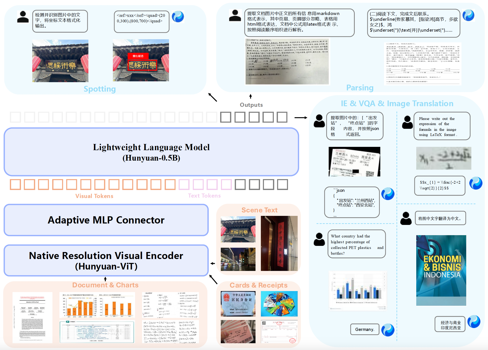

<p align="center">
  <br>
</p>

<div align="center">

[中文](./README_zh.md) | [English](./README.md)

# HunyuanOCR: 基于混元架构的1B参数端到端多语言OCR模型

📑 论文与模型权重即将发布！

[演示](#演示) | [安装](#安装) | [快速开始](#快速开始) | [文档](#文档)

</div>

## 🔥 最新动态
- **[2025/11/20]** 📝 推理代码和模型权重已开源。

## 📖 简介
HunyuanOCR是一款基于混元原生多模态架构的端到端OCR专家模型。仅以1B轻量化参数，便已斩获多项业界SOTA成绩。该模型精通复杂文档解析，同时在多语种文字识别、票据字段抽取、字幕提取、拍照翻译等全场景实用技能中表现出色。

基于腾讯混元技术打造，该模型通过端到端架构设计和单次推理，提供卓越性能的同时大幅简化部署流程，在与传统级联系统和商用API的对比中保持竞争优势。

<div align="center">
  
</div>

## ✨ 核心特点

- 💪 **轻量化架构**：基于混元原生多模态架构与训练策略，打造仅1B参数的OCR专项模型，大幅降低部署成本。

- 📑 **全场景功能**：单一模型覆盖文字检测和识别、复杂文档解析、票据字段抽取、字幕提取等OCR经典任务，更支持端到端拍照翻译与文档问答。

- 🚀 **极致易用**：深度贯彻大模型"端到端"理念，单一指令、单次推理直达SOTA结果，较业界级联方案更高效便捷。

- 🌏 **多语种支持**：支持超过100种语言，在单语种和混合语言场景下均表现出色。

## 📋 模型结构

| 组件 | 架构 | 参数量 | 功能 |
|-----------|-------------|------------|-----------|
| 视觉编码器 | SigVLIP-v2 (ViT-based) | 400M | 图像处理与特征提取 |
| 语言模型 | Hunyuan-LLM | 500M | 文本理解与生成 |
| 视觉语言桥接 | MLP Adapter | 90M | 多模态特征融合 |
| **总计** | - | **~1B** | 端到端OCR与文档理解 |

## 🛠️ 环境依赖与安装

### 系统要求
- 🖥️ 操作系统：Linux
- 🐍 Python版本：3.12+（推荐）
- ⚡ CUDA版本：12.8
- 🔥 PyTorch版本：2.7.1
- 🎮 GPU：支持CUDA的NVIDIA显卡
- 🧠 GPU显存：≥3×80GB（推荐4×80GB以获得更好性能）
- 💾 磁盘空间：170GB（用于存储模型权重）

### 安装步骤
```bash
pip install https://mirrors.tencent.com/repository/generic/transformers/transformers-4.56.0.post2-py3-none-any.whl
pip install opencv-python-headless
pip install torch==2.7.1 torchvision==0.22.1 torchaudio==2.7.1 --index-url https://download.pytorch.org/whl/cu128
```
